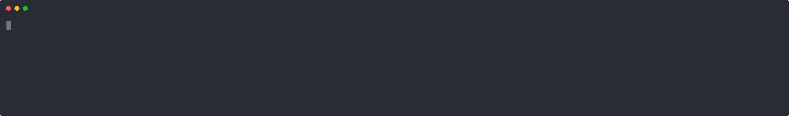

# unity-scene-repacker



When modding a unity game, you often want to `Instantiate` objects from a scene that isn't loaded.
One solution for this is to load all the scenes you're interested in at startup, copy the gameobjects somewhere and unload the scene.
This works, but is slow and memory intensive.

This project lets you read scenes from the distributed game, take only what you need, and package those objects into an [AssetBundle](https://docs.unity3d.com/Manual/AssetBundlesIntro.html) that you can load at runtime.

## Installation

```sh
uv tool install unity-scene-repacker
```

## Usage

`unity-scene-repacker` can repack objects into two kinds of [`AssetBundle`](https://docs.unity3d.com/ScriptReference/AssetBundle.html)s.
- Scene bundles contain the original scenes, filtered down to only the requested objects.
- Asset bundles allow you to selectively load objects without having to load all of them, but are a bit more experimental.

**Scene bundle**:

```jsonc
objects.json
{
  "Fungus1_12": [
    "simple_grass",
    "green_grass_2",
    "green_grass_3",
    "green_grass_1 (1)"
  ],
  "White_Palace_01": [
    "WhiteBench",
    "White_ Spikes"
  ]
}
```

```sh
unity-scene-repacker \
    --steam-game 'Hollow Knight' \
    --scene-objects objects.json \
    --mode scene \
    --output mybundle.unity3d
```


```cs
const string bundleName = "mybundle";
var bundle = AssetBundle.LoadFromFile(path);

// load single scene
SceneManager.LoadScene($"unity-scene-repacker/{bundleName}/Fungus1_12.unity")

// load add scenes
foreach (string scenePath in bundle.GetAllScenePaths()) {
    string sceneName = Path.GetFileNameWithoutExtension(scenePath);
    SceneManager.LoadScene(sceneName, LoadSceneMode.Additive);
    var scene = USceneManager.GetSceneByPath(scenePath);
    var roots = scene.GetRootGameObjects();
}
bundle.Unload();
```

**Asset bundle**:

Asset bundles allow you to selectively load objects, without having to load the others into memory.
However, the implementation is a bit more experimental, so if something doesn't work, try the scene output instead.

```sh
unity-scene-repacker \
    --steam-game 'Hollow Knight' \
    --scene-objects objects.json \
    --mode asset \
    --output mybundle.unity3d
```


```cs
var bundle = AssetBundle.LoadFromFile(path);
var prefab = bundle.LoadAsset<GameObject>("Fungus1_12/simple_grass");
var object = Instantiate(prefab);
bundle.Unload();
```

The `asset` output mode also allows you to additionally specify arbitrary other objects (e.g. `ScriptableObject`s) by name:

```json
{
  "FXDealerMaterialTag": ["[FXDealer] 0_YeeAttack _PostureDecrease"]
}
```

```sh
unity-scene-repacker ... --extra-objects objects-by-type.json --mode asset
```

```cs
var object = bundle.LoadAsset<FXDealerMaterialTag>("ExtraObjects/FXDealerMaterialTag/[FXDealer] 0_YeeAttack _PostureDecrease.prefab");
```

### CLI Reference

```
Usage: unity-scene-repacker [OPTIONS] <--game-dir <GAME_DIR>|--steam-game <STEAM_GAME>>

Options:
  -h, --help
          Print help (see a summary with '-h')

  -V, --version
          Print version

Game options:
      --game-dir <GAME_DIR>
          Directory where the levels files are, e.g. steam/Hollow_Knight/hollow_knight_Data

      --steam-game <STEAM_GAME>
          App ID or search term for the steam game to detect

Repack options:
      --scene-objects <SCENE_OBJECTS>
          Path to JSON file, containing a map of scene name to a list of gameobject paths to include

            {
              "Fungus1_12": [
                "simple_grass",
                "green_grass_2",
              ],
              "White_Palace_01": [
                "WhiteBench",
              ]
            }


      --extra-objects <EXTRA_OBJECTS>
          Path to JSON file, containing a map of C# type to monobehaviour names. Useful for scriptable objects etc., which do not exist in the transform hierarchy.

            {
              "FXDealerMaterialTag": ["[FXDealer] 0_YeeAttack _PostureDecrease"]
            }


Output options:
      --mode <MODE>
          [default: scene]

          Possible values:
          - scene:         A scene asset bundle, containing the original scenes filtered. Load using LoadScene
          - asset:         An asset bundle containing individual assets you can load using LoadAsset. The objects are copied from the original level files
          - asset-shallow: An asset bundle containing individual assets you can load using LoadAsset. The bundle is completely empty, and only references the original game level files

      --disable
          When true, all gameobjects in the scene will start out disabled

      --compression <COMPRESSION>
          Compression level to apply

          [default: lzma]

          Possible values:
          - none
          - lzma
          - lz4hc: Best compression at the cost of speed

  -o, --output <OUTPUT>
          [default: out.unity3d]

      --bundle-name <BUNDLE_NAME>
          Name to give the assetbundle. Should be unique for your game
```
